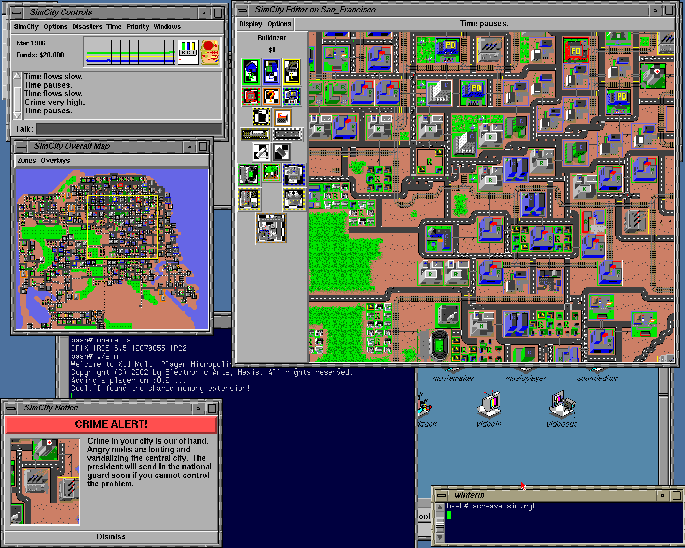

# Micropolis for Vintage Unix

This is a fork of [Micropolis Activity](https://github.com/SimHacker/micropolis/tree/master/micropolis-activity). It's uses the ["old gen"](https://wiki.laptop.org/go/Micropolis#Old_Generation:_C_TCL/Tk_Micropolis) source code, which had only minor cosmetic changes compared to [DUX SimCity for Unix](https://web.archive.org/web/19970714233606/http://www.dux.com/simctyux.html). It expects assets from the original DUX SimCity, effectively reversing changes mentioned in [here](https://raw.githubusercontent.com/SimHacker/micropolis/master/micropolis-activity/src/PLAN.txt). Targets vintage Unix systems not supported by DUX Simcity.

## Installation

Download a demo version of [DUX SimCity for Unix](https://web.archive.org/web/19970714233306/http://www.dux.com/demo.html) also mirrored [here](http://osarchive.org/apps/simcity) and [here](http://tenox.pdp-11.ru/apps/simcity/).

Unpack the tarball to a folder on your disk, typically somewhere under `/usr`.

Replace `yourfolder/res/sim` with the binary from the releases folder (or compile yourself). 

## Currently supported OS

- AIX 4.3, 5.1 (ppc, ia64)
- IRIX 6.5 (mips)
- HP-UX 11i (hppa2)

## Planned

- HP-UX 11.31 (ia64)
- Solaris 10 (x64)

## Maybe

- UnixWare
- Dell Unix
- Sinix
- Dynix
- DG/UX
- Minix
- Ultrix
- Interactive Unix
- Solaris (ppc)

## Maybe Not

- Solaris 11 - no X11
- QNX - no X11
- NextStep - no X11
- A/UX - no X11

## Legal

- License: GPL
- Copyright (C) 1989 - 2007 Electronic Arts Inc.
